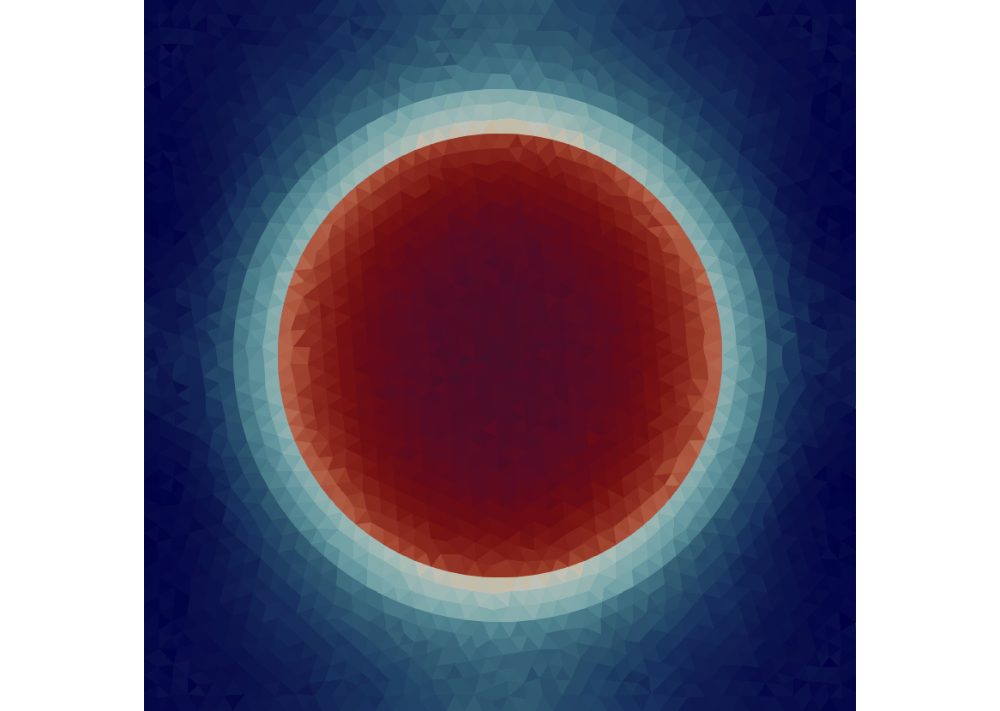
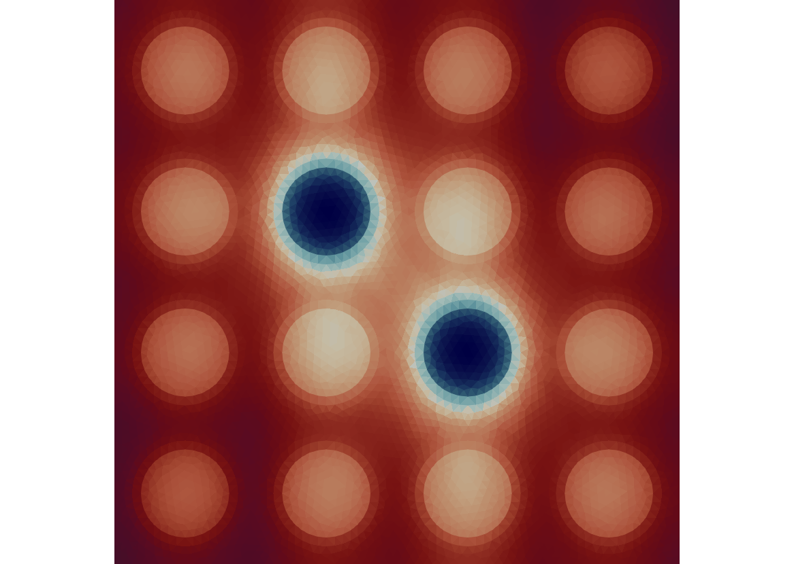
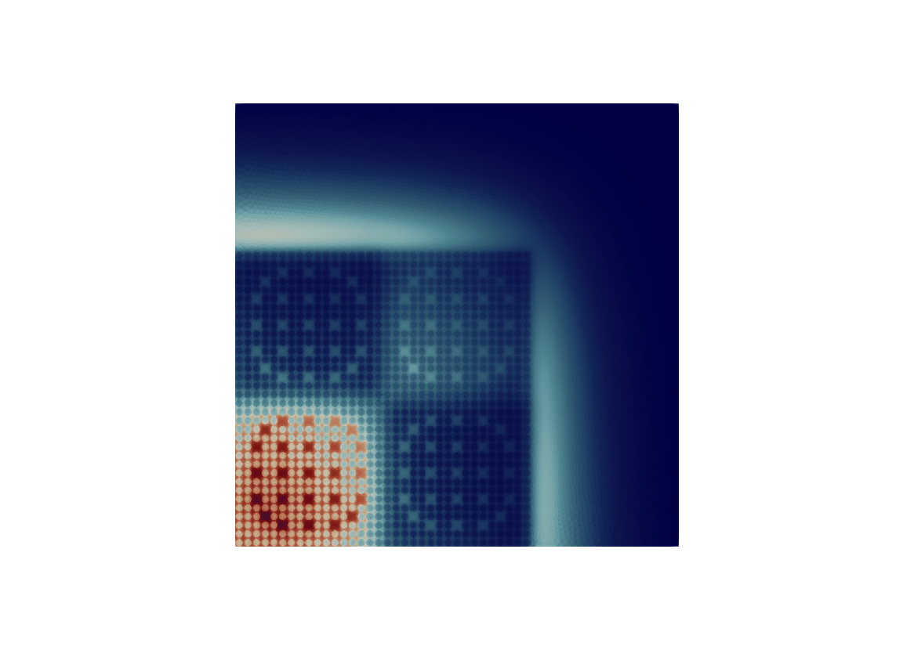

# NeutronTransport

| **Documentation** |
|:------------ |
| [](https://rvignolo.github.io/NeutronTransport.jl/stable/) [](https://rvignolo.github.io/NeutronTransport.jl/dev/) |
|**Build Status** |
| [](https://github.com/rvignolo/NeutronTransport.jl/actions) |

## Description

**NeutronTransport** is a reactor physics program that solves the steady-state multigroup [neutron transport equation](https://en.wikipedia.org/wiki/Neutron_transport#Neutron_transport_equation) by means of the Method of Characteristics approximation over unstructured grids. It relies on [RayTracing.jl](https://github.com/rvignolo/RayTracing.jl) for the tracking procedure.

## Installation

The package can be installed using the Julia package manager. From the Julia REPL, type `]` to enter the `Pkg` REPL mode and run:

```julia
pkg> add NeutronTransport
```

Or, equivalently, via the `Pkg` API:

```julia
julia> import Pkg; Pkg.add("NeutronTransport")
```

## Examples

These are some popular examples solved with NeutronTransport:

|  |  |  |
|:-------------:|:-------------:|:-------------:|
| [*Pincell*](demo/pincell.jl) | [4 by 4 BWR lattice (2 Gd pins)](demo/bwr.jl) | [C5G7 Benchmark](demo/c5g7.jl) |

## Plotting and Export

Plotting backends are optional. NeutronTransport exposes lightweight
[`RecipesBase.jl`](https://github.com/JuliaPlots/RecipesBase.jl) recipes, so a plotting
frontend such as Plots.jl can render solution fields without becoming a required runtime
dependency:

```julia
using NeutronTransport
using Plots

plot(CellScalarField(sol, 1))  # scalar flux, energy group 1
plot(PinPowerMap(pin_powers; active=active_pins))
```

For VTK export through Gridap, use `cell_scalar_flux(sol, g)` instead of `sol(g)`. This
expands transport flat source region values back to mesh-cell values, which keeps exports
correct even when several cells are coalesced into one transport region.

For benchmark-style pin powers or fission-rate diagnostics, provide optional `Σf` data to
`CrossSections`; eigenvalue solves continue to use `νΣf` for the fission source.
